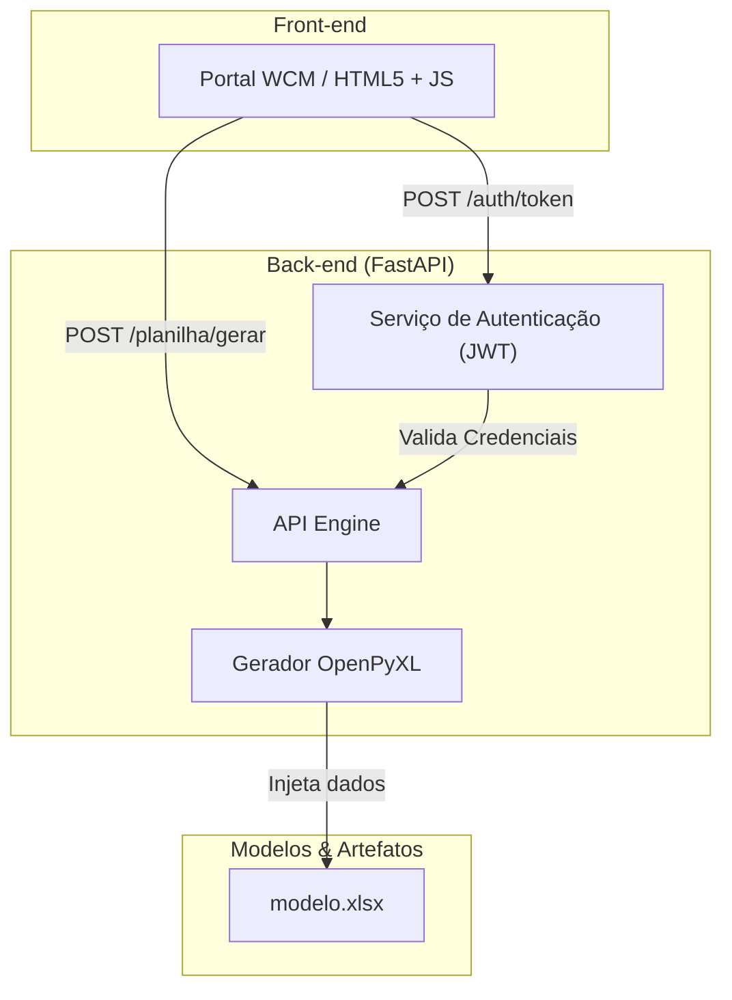
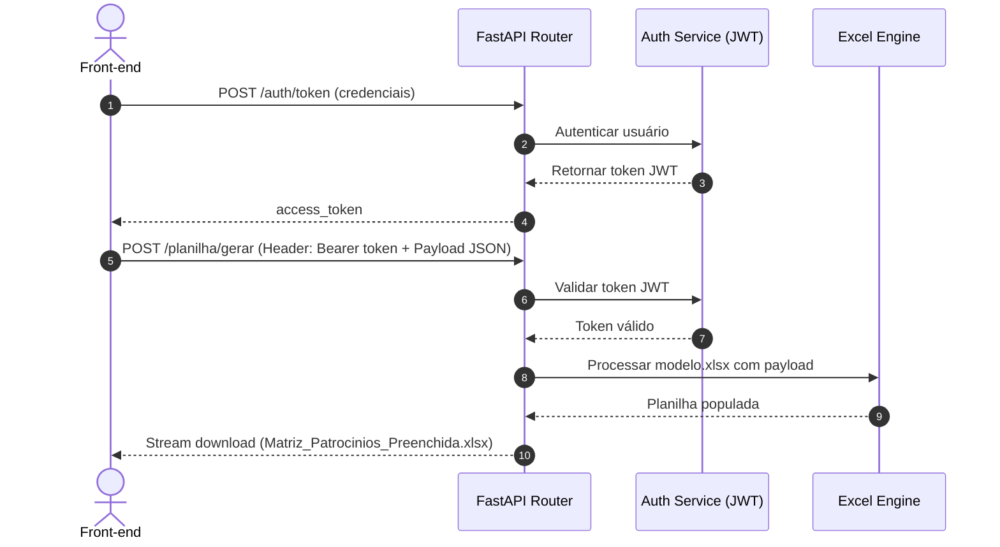

# Matriz de Patrocínios COPASA


Sistema de avaliação e gestão de patrocínios da COPASA, desenvolvido para automatizar o processo de preenchimento, cálculo de pontuação e geração da planilha oficial da Matriz Integrada de Avaliação de Patrocínios.

---

## 📋 Sumário

- [Sobre o Projeto](#sobre-o-projeto)
- [Arquitetura](#arquitetura)
- [Tecnologias](#tecnologias)
- [Pré-requisitos](#pré-requisitos)
- [Instalação e Configuração](#instalação-e-configuração)
- [Estrutura do Projeto](#estrutura-do-projeto)
- [Endpoints da API](#endpoints-da-api)
- [Fluxo de Autenticação](#fluxo-de-autenticação)
- [Front-end](#front-end)
- [Roadmap](#roadmap)
- [Contribuição](#contribuição)
- [Licença e Contato](#licença-e-contato)

---

## 🎯 Sobre o Projeto

A **Matriz de Patrocínios COPASA** é uma solução corporativa que digitaliza e otimiza o fluxo de avaliação de projetos culturais, sociais e esportivos submetidos à COPASA. O sistema substitui o preenchimento manual de planilhas locais, oferecendo:

* **Formulário Digital Integrado:** Interface amigável com validação dos campos obrigatórios em tempo real.
* **Cálculo Automatizado:** Determinação instantânea de pontuação e classificação final (de *Zero* a *Excelente*).
* **Consistência de Dados:** Geração de relatórios em Excel padronizados exatamente conforme o modelo oficial da companhia.
* **Segurança:** Controle de acesso autenticado via tokens JWT.
* **Integração WCM:** Layout responsivo pronto para embutimento no portal WCM da COPASA.

---

## 🏗️ Arquitetura

O projeto adota uma arquitetura cliente-servidor desacoplada:



---

## 🛠️ Tecnologias

### Back-end
| Tecnologia | Versão | Finalidade |
| :--- | :---: | :--- |
| **FastAPI** | `^0.104` | Framework web assíncrono de alta performance |
| **Uvicorn** | `^0.24` | Servidor de aplicação ASGI |
| **Python-JOSE** | `^3.3` | Implementação e validação de tokens JWT |
| **Passlib** | `^1.7` | Hashing seguro de senhas (BCrypt) |
| **OpenPyXL** | `^3.1` | Leitura, escrita e manipulação de modelos Excel |
| **Python-Dotenv** | `^1.0` | Gerenciamento de variáveis de ambiente |

### Front-end
| Tecnologia | Finalidade |
| :--- | :--- |
| **HTML5 / CSS3** | Estrutura semântica, responsividade e componentes visuais |
| **JavaScript (ES6+)** | Lógica de preenchimento, validações em tempo real e consumo da API |

### Gerenciamento de Dependências
| Ferramenta | Finalidade |
| :--- | :--- |
| **UV** | Gerenciador de pacotes e ambientes virtuais Python de alta velocidade |

---

## 📦 Pré-requisitos

* **Python 3.10** ou superior
* **UV** (recomendado) ou `pip`
* **Git**

### Instalando o UV (opcional, recomendado)

```bash
curl -LsSf https://astral.sh/uv/install.sh | sh
```

---

## ⚙️ Instalação e Configuração

### 1. Clonar o Repositório
```bash
git clone https://github.com/seu-usuario/matriz-patrocinio.git
cd matriz-patrocinio
```

### 2. Ambiente Virtual
Criar e ativar o ambiente virtual:

```bash
# Criar ambiente virtual
uv venv

# Ativar no Linux/macOS:
source .venv/bin/activate

# Ativar no Windows:
.venv\Scripts\activate
```

### 3. Instalar Dependências
```bash
uv pip install -r requirements.txt
```

### 4. Variáveis de Ambiente
Crie um arquivo `.env` na raiz do projeto com as configurações desejadas:

```env
SECRET_KEY=sua_chave_secreta_aqui
ALGORITHM=HS256
ACCESS_TOKEN_EXPIRE_MINUTES=30
```

### 5. Planilha Modelo
Verifique se o arquivo `modelo.xlsx` (template oficial da matriz) está presente no diretório raiz da aplicação.

### 6. Executar o Servidor
```bash
python main.py
```

A API estará disponível em `http://localhost:8000`.

### 7. Documentação Interativa
* **Swagger UI:** `http://localhost:8000/docs`
* **ReDoc:** `http://localhost:8000/redoc`

---

## 📁 Estrutura do Projeto

```text
matriz-patrocinio/
├── main.py                 # Ponto de entrada da aplicação FastAPI
├── core/                   # Módulos centrais da aplicação
│   ├── __init__.py
│   ├── auth.py             # Lógica de segurança e autenticação JWT
│   ├── config.py           # Carregamento de variáveis de ambiente
│   └── planilha.py         # Processamento e geração da planilha Excel
├── routers/                # Controladores / Endpoints da API
│   ├── __init__.py
│   ├── auth.py             # Endpoints de login e perfil
│   └── planilha.py         # Endpoint para geração de relatórios
├── schemas/                # Modelos de validação Pydantic
│   ├── __init__.py
│   └── planilha.py         # Schemas do formulário de entrada
├── db/                     # Camada reservada para persistência (Banco de Dados)
│   └── __init__.py
├── .env                    # Variáveis de ambiente locais
├── .gitignore
└── requirements.txt        # Dependências do projeto
```

---

## 🔗 Endpoints da API

### 🔐 Autenticação

#### `POST /auth/token`
Autentica o usuário e retorna o token de acesso JWT.

* **Headers:** `Content-Type: application/x-www-form-urlencoded`
* **Body:**
  ```form-data
  username=usuario
  password=senha
  ```
* **Resposta (200 OK):**
  ```json
  {
    "access_token": "eyJhbGciOiJIUzI1Ni...",
    "token_type": "bearer"
  }
  ```

#### `GET /auth/me`
Retorna as informações do usuário autenticado.

* **Headers:** `Authorization: Bearer <seu_token_jwt>`

---

### 📊 Planilha

#### `POST /planilha/gerar`
Gera a planilha Excel preenchida a partir das respostas submetidas.

* **Headers:** 
  * `Authorization: Bearer <seu_token_jwt>`
  * `Content-Type: application/json`
* **Resposta (200 OK):**
  * Retorno do arquivo binário `.xlsx` (`Matriz_Patrocinios_Preenchida.xlsx`) para download.

---

## 🔄 Fluxo de Autenticação e Geração



---

## 🖥️ Front-end & Integração WCM

O front-end é uma solução *Single Page* leve e responsiva construída em HTML5/CSS3/JS puro:

* **Dinâmico:** Campos renderizados automaticamente com base no esquema de perguntas.
* **Feedback ao usuário:** Barras de progresso e notificações *toast*.
* **Cálculo Local:** Estimativa preliminar da pontuação antes do envio.

### Procedimento para Integração no WCM
1. Copie o conteúdo de `index.html` para a página / widget desejado no WCM da COPASA.
2. Atualize o endpoint da API na constante de configuração JavaScript do arquivo.
3. Certifique-se de que a origem do WCM está autorizada no Middleware CORS da API FastAPI.

---

## 🚀 Roadmap de Desenvolvimento

- [ ] **Fase 1: Inteligência Artificial & Automação**
  - [ ] Assistente para sugestão automática de notas por critério (LangChain + LLM local).
  - [ ] Sumarização automática do projeto com destaques dos pontos fortes.
  - [ ] Verificação automática de riscos e inconformidades no formulário.
  - [ ] Chatbot de RAG para suporte ao avaliador sobre normas de patrocínio.

- [ ] **Fase 2: Dashboard & Analytics**
  - [ ] Painel executivo de acompanhamento das propostas recebidas.
  - [ ] Relatórios analíticos exportáveis para Power BI.

- [ ] **Fase 3: Persistência & SSO**
  - [ ] Banco de dados relacional para guardar o histórico das avaliações.
  - [ ] Integração com Single Sign-On (SSO / Active Directory COPASA).

- [ ] **Fase 4: Expansão Mobile**
  - [ ] PWA para preenchimento com suporte offline.

---

## 🤝 Contribuição

1. Faça o **Fork** do repositório.
2. Crie uma branch para sua feature (`git checkout -b feature/minha-feature`).
3. Faça o **Commit** de suas alterações (`git commit -m 'feat: adiciona nova funcionalidade'`).
4. Envie para a branch remota (`git push origin feature/minha-feature`).
5. Abra um **Pull Request**.

---

## 📄 Licença e Contato

Direitos reservados à **COPASA - Companhia de Saneamento de Minas Gerais**. Uso interno exclusivo.

Para dúvidas ou suporte, entre em contato com a equipe de TI / Comunicação Corporativa.