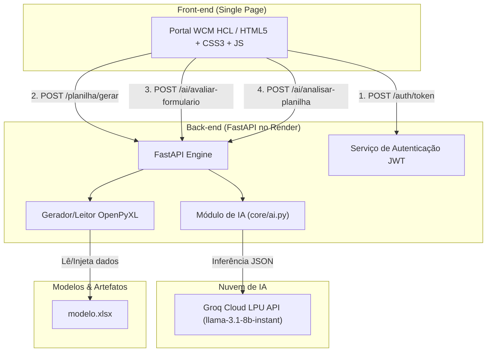
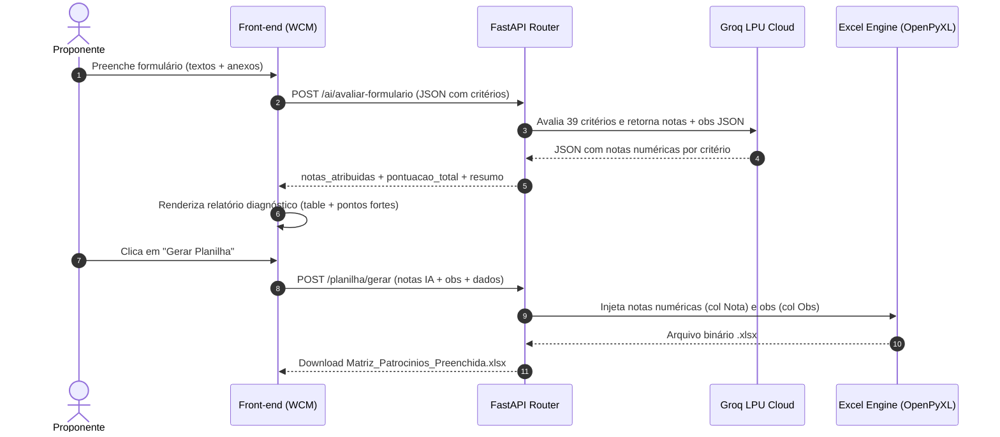

# Matriz de Patrocínios COPASA


Sistema corporativo de avaliação e gestão de patrocínios da **COPASA**, desenvolvido para digitalizar a avaliação de projetos culturais, sociais e esportivos. A solução automatiza o preenchimento de propostas, realiza o cálculo de pontuação em tempo real, efetua análises de diagnóstico com **Inteligência Artificial (Groq Cloud)** e gera a planilha oficial da Matriz Integrada no formato Excel (`.xlsx`).

---

## 📋 Sumário

- [Sobre o Projeto](#-sobre-o-projeto)
- [Funcionalidades Principais](#-funcionalidades-principais)
- [Arquitetura & Fluxos](#-arquitetura--fluxos)
- [Tecnologias Utilizadas](#-tecnologias-utilizadas)
- [Pré-requisitos](#-pré-requisitos)
- [Guia Passo a Passo de Instalação e Execução](#-guia-passo-a-passo-de-instalação-e-execução)
- [Estrutura do Projeto](#-estrutura-do-projeto)
- [Endpoints da API](#-endpoints-da-api)
- [Campos com Suporte a Anexos](#-campos-com-suporte-a-anexos)
- [Boas Práticas & Segurança](#-boas-práticas--segurança)
- [Hospedagem no Render & Uptime](#-hospedagem-no-render--uptime)
- [Integração no Portal WCM HCL](#-integração-no-portal-wcm-hcl)
- [Roadmap de Desenvolvimento](#-roadmap-de-desenvolvimento)
- [Licença e Contato](#-licença-e-contato)

---

## 🎯 Sobre o Projeto

A **Matriz de Patrocínios COPASA** substitui o preenchimento manual de planilhas locais descentralizadas por um fluxo web integrado, seguro e inteligente.

A plataforma atende a duas vertentes operacionais:
1. **Formulário de Avaliação Integrado:** Interface responsiva para o proponente preencher dados e critérios de avaliação, com cálculo dinâmico de pontuação (escala até **1.000 pontos**), validação em tempo real e suporte a **anexos de documentos** em campos específicos.
2. **Diagnóstico Inteligente com IA:** Módulo de avaliação que usa LLM em nuvem (**Groq Cloud LPU**) para analisar todos os critérios preenchidos e gerar um relatório executivo completo com pontuação por eixo, pontos fortes e oportunidades de melhoria.

---

## ✨ Funcionalidades Principais

* **Formulário Dinâmico em Abas (Segmented Control):** Navegação fluida e moderna entre a aba de preenchimento e a aba do analisador de IA.
* **Validação em Tempo Real:** Limite máximo por critério (ex: *36 pontos* em Impacto Social, *33 pontos* em Comunicação), bloqueio de valores fora do limite e validação visual de e-mails/campos obrigatórios.
* **Cálculo e Classificação Automática:** Pontuação total recalculada instantaneamente com indicador visual proporcional (faixas de *Zero* a *Excelente*).
* **Geração Oficial em Excel:** Injeção precisa dos dados no modelo oficial da companhia (`modelo.xlsx`) via OpenPyXL preservando formatação e fórmulas. Notas numéricas da IA são gravadas na coluna **Nota** e observações na coluna **Obs**.
* **Relatório Diagnóstico de IA:** Avaliação via Groq com pontuação por eixo (6 seções), resumo do projeto, pontos fortes, oportunidades de melhoria e conclusão — com ícones SVG e tabela de resumo executivo.
* **Campos com Suporte a Anexos:** 6 campos do formulário aceitam upload de documentos (PDF, Word, imagens, Excel). Três deles são obrigatórios.
* **Modo Demo (Preencher Demo):** Botão para preenchimento automático com 3 perfis aleatórios, útil para demonstrações.
* **Pronto para Portal Corporativo:** Layout desacoplado e responsivo sem vazamento de espaçamentos no rodapé ou cabeçalho do portal WCM HCL da COPASA.

---

## 🏗️ Arquitetura & Fluxos

### Arquitetura Geral do Sistema



### Fluxo de Avaliação com IA e Geração da Planilha



---

## 🛠️ Tecnologias Utilizadas

### Back-end
| Tecnologia | Versão | Finalidade |
| :--- | :---: | :--- |
| **FastAPI** | `^0.141` | Framework web assíncrono de alta performance |
| **Uvicorn** | `^0.52` | Servidor de aplicação ASGI |
| **HTTPX** | `^0.28` | Cliente HTTP assíncrono para comunicação com a Groq API |
| **Python-JOSE** | `^3.5` | Implementação e validação de tokens JWT |
| **Passlib** | `^1.7` | Hashing seguro de senhas (PBKDF2-SHA256) |
| **OpenPyXL** | `^3.1` | Leitura, escrita e extração de dados da planilha `.xlsx` |
| **Pydantic-Settings** | `^2.14` | Gerenciamento e validação de variáveis de ambiente |

### Inteligência Artificial
| Tecnologia | Provedor | Modelo Padrão | Finalidade |
| :--- | :--- | :--- | :--- |
| **Groq Cloud LPU API** | Groq Inc. | `llama-3.1-8b-instant` | Avaliação de 39 critérios em JSON, diagnóstico executivo e cálculo de pontuação por eixo |

### Front-end
| Tecnologia | Finalidade |
| :--- | :--- |
| **HTML5 / Vanilla CSS** | Estrutura semântica, isolamento CSS (`#mp-root`) e navegação por abas *Segmented Control* |
| **JavaScript (ES6+)** | Cálculo dinâmico de pontuação, limites teto em tempo real, upload de arquivos e consumo da API |
| **Lucide/Feather Icons** | Conjunto de ícones vetoriais SVG inline (sem emojis) |

### Gerenciamento de Dependências
| Ferramenta | Finalidade |
| :--- | :--- |
| **UV** | Gerenciador de pacotes e ambientes virtuais Python de altíssima velocidade |

---

## 📦 Pré-requisitos

Antes de iniciar a instalação local, certifique-se de possuir:

* **Python 3.12** ou superior instalado.
* **UV** (recomendado) ou **pip**.
* **Git** configurado na máquina.
* **Chave de API do Groq** (gratuita em [console.groq.com](https://console.groq.com/)).

---

## ⚙️ Guia Passo a Passo de Instalação e Execução

### Passo 1: Clonar o Repositório
```bash
git clone https://github.com/andreeeestor/Matriz-de-Patrocinios-COPASA.git
cd matriz-patrocinio
```

### Passo 2: Criar o Ambiente Virtual e Instalar Dependências

Com o **UV** (Recomendado):
```bash
# Instalar o UV (caso não tenha)
curl -LsSf https://astral.sh/uv/install.sh | sh

# Sincronizar o ambiente e instalar dependências
uv sync
```

Com o **pip** tradicional:
```bash
# Criar ambiente virtual
python -m venv .venv

# Ativar o ambiente virtual
# Linux/macOS:
source .venv/bin/activate
# Windows:
.venv\Scripts\activate

# Instalar dependências
pip install -r pyproject.toml
```

### Passo 3: Configurar Variáveis de Ambiente
Crie um arquivo `.env` na raiz do projeto com o seguinte conteúdo:

```env
SECRET_KEY=sua_chave_secreta_jwt_aqui
ALGORITHM=HS256
ACCESS_TOKEN_EXPIRE_MINUTES=30
GROQ_API_KEY=gsk_sua_chave_groq_aqui
GROQ_MODEL=llama-3.1-8b-instant
```

### Passo 4: Verificar a Planilha Modelo
Garantir que o arquivo `modelo.xlsx` (template oficial da matriz) está presente na raiz da aplicação.

### Passo 5: Executar o Servidor Local
Com o **UV**:
```bash
uv run python main.py
```
Ou com o **Python nativo**:
```bash
python main.py
```

O servidor iniciará em `http://localhost:8000`.

### Passo 6: Acessar a Aplicação
- **Interface Web:** Acesse `http://localhost:8000/` no seu navegador.
- **Credenciais Padrão de Teste:**
  - **Usuário:** `carmem`
  - **Senha:** `querida`
- **Documentação Swagger UI:** `http://localhost:8000/docs`
- **Documentação ReDoc:** `http://localhost:8000/redoc`

---

## 📁 Estrutura do Projeto

```text
matriz-patrocinio/
├── main.py                 # Ponto de entrada e rotas principais da aplicação FastAPI
├── core/                   # Módulos centrais de regra de negócio
│   ├── __init__.py
│   ├── ai.py               # Extração de dados de .xlsx, integração com Groq e avaliação de formulários
│   ├── auth.py             # Autenticação JWT, verificação de senhas e middlewares
│   ├── config.py           # Carregamento seguro das configurações (.env) via Pydantic
│   └── planilha.py         # Mapeamento de células (CELL_MAP) e manipulação do Excel (OpenPyXL)
├── routers/                # Controladores de rotas / endpoints
│   ├── __init__.py
│   ├── ai.py               # Endpoints /ai/status, /ai/analisar-planilha, /ai/avaliar-formulario
│   ├── auth.py             # Endpoints /auth/token e /auth/me
│   └── planilha.py         # Endpoint /planilha/gerar
├── schemas/                # Schemas de validação de dados Pydantic
│   ├── __init__.py
│   └── planilha.py         # Schema de entrada dos dados da planilha (PlanilhaData)
├── template/               # Frontend da aplicação
│   └── index.html          # Single Page Application (HTML5 + CSS3 + JS puro)
├── modelo.xlsx             # Template base oficial da planilha de patrocínios COPASA
├── pyproject.toml          # Configuração do projeto e dependências Python
├── uv.lock                 # Trava de versões das dependências
├── .env                    # Variáveis de ambiente locais (não versionado)
└── .gitignore
```

---

## 🔗 Endpoints da API

### 🔐 Autenticação

#### `POST /auth/token`
Autentica o usuário e retorna o token de acesso JWT.

* **Headers:** `Content-Type: application/x-www-form-urlencoded`
* **Body:** `username=carmem&password=querida`
* **Resposta (200 OK):**
  ```json
  {
    "access_token": "eyJhbGciOiJIUzI1Ni...",
    "token_type": "bearer"
  }
  ```

#### `GET /auth/me`
Retorna os dados do usuário autenticado.

* **Headers:** `Authorization: Bearer <token_jwt>`

---

### 📊 Planilha

#### `POST /planilha/gerar`
Popula o modelo Excel com os dados do formulário e retorna o arquivo binário `.xlsx`.

* **Headers:** `Authorization: Bearer <token_jwt>`, `Content-Type: application/json`
* **Body:** JSON com todos os campos do formulário. Quando a IA avalia antes da geração, as notas numéricas substituem os textos e as justificativas vão para os campos `_obs`.
* **Resposta (200 OK):** Binary stream do arquivo `.xlsx` (`Matriz_Patrocinios_Preenchida.xlsx`).

---

### 🤖 Inteligência Artificial (Groq Cloud)

#### `GET /ai/status`
Verifica a conectividade e a validade da chave `GROQ_API_KEY`.

* **Headers:** `Authorization: Bearer <token_jwt>`
* **Resposta (200 OK):**
  ```json
  {
    "status": "online",
    "provedor": "Groq Cloud LPU",
    "modelo_configurado": "llama-3.1-8b-instant"
  }
  ```

#### `POST /ai/avaliar-formulario`
Recebe os dados textuais preenchidos no formulário e usa a IA para atribuir notas a todos os 39 critérios de avaliação.

* **Headers:** `Authorization: Bearer <token_jwt>`, `Content-Type: application/json`
* **Body:** JSON com os campos do formulário (textos descritivos nos campos `_nota`).
* **Resposta (200 OK):**
  ```json
  {
    "sucesso": true,
    "modelo_usado": "llama-3.1-8b-instant",
    "pontuacao_total_obtida": 716.0,
    "pontuacao_maxima_possivel": 1000,
    "notas_atribuidas": {
      "valores_organizacionais_nota": 17.0,
      "valores_organizacionais_obs": "Justificativa da IA...",
      "portfolio_nota": 22.0,
      "portfolio_obs": "Justificativa da IA..."
    },
    "resumo_avaliador": "Projeto com sólido alinhamento estratégico...",
    "pontos_fortes": ["Excelente portfólio de projetos anteriores"],
    "oportunidades_melhoria": [
      {
        "criterio": "voluntariado_corporativo_nota",
        "nota_atual": 10,
        "nota_maxima": 25,
        "recomendacao": "Inserir ações práticas de engajamento dos colaboradores."
      }
    ]
  }
  ```

#### `POST /ai/analisar-planilha`
Extrai os dados de uma planilha `.xlsx` enviada e solicita diagnóstico inteligente à Groq API.

* **Headers:** `Authorization: Bearer <token_jwt>`
* **Body:** `multipart/form-data` contendo `file: <planilha.xlsx>`
* **Resposta:** Mesmo formato do endpoint `/ai/avaliar-formulario`.

---

## 📎 Campos com Suporte a Anexos

O formulário permite upload de documentos em 6 campos específicos. Os formatos aceitos são: `.pdf`, `.doc`, `.docx`, `.jpg`, `.jpeg`, `.png`, `.xlsx`, `.xls`.

| Campo | Seção | Tipo de Anexo | Obrigatório |
| :--- | :--- | :--- | :---: |
| **Código de Aprovação** | Informações do Projeto | Comprovante de aprovação | ✅ |
| **Data de Prorrogação** | Informações do Projeto | Documento de prorrogação | ✅ |
| **Portfólio** | Capacidade Institucional | Arquivo de portfólio (PDF, imagens) | ✅ |
| **Sustentabilidade** | Alinhamento Estratégico | Foto ou documento de sustentabilidade | Opcional |
| **Capacidade Técnica** | Capacidade Institucional | Currículo ou certificações | Opcional |
| **Experiência e Resultados** | Capacidade Institucional | Relatórios ou registros de resultados | Opcional |

> **Nota:** Os campos obrigatórios (marcados com `*` no botão `+ Anexar`) bloqueiam a geração da planilha e a verificação de pontuação até que o arquivo seja adicionado.

---

## 🛡️ Boas Práticas & Segurança

1. **Gestão de Segredos:** A `SECRET_KEY` e a `GROQ_API_KEY` são injetadas exclusivamente via variáveis de ambiente e possuem fallbacks seguros em [core/config.py](file:///Users/andrenestor/Documents/COPASA/matriz-patrocinio/core/config.py). O arquivo `.env` está devidamente registrado no `.gitignore`.
2. **Sanitização de Entradas no Frontend:** As notas inseridas pelo usuário passam por validação dinâmica no JavaScript, impedindo valores negativos ou superiores aos limites máximos teto de cada critério.
3. **Padrão Estrito de Resposta da IA:** As chamadas à API da Groq utilizam `response_format: {"type": "json_object"}`, garantindo que o retorno seja parseado com segurança sem quebras de formato.
4. **Isolamento de Estilos no WCM:** Todos os seletores CSS da interface iniciam com a raiz `#mp-root`, prevenindo conflitos de estilos com o portal corporativo.
5. **Separação Nota/Obs na Planilha:** A função `gerar_planilha` diferencia automaticamente valores numéricos (coluna Nota) de textos descritivos (coluna Obs), garantindo integridade dos dados na planilha final.

---

## 🌐 Hospedagem no Render & Uptime

A API backend está implantada no serviço **Render**:
* **URL de Produção:** `https://matriz-patrocinios-copasa.onrender.com`
* **Documentação Swagger (Produção):** `https://matriz-patrocinios-copasa.onrender.com/docs`

### Prevenção de "Sleep" (Free Tier)
Como o plano gratuito do Render hiberna após 15 minutos sem uso, utilize o **UptimeRobot**:
1. Cadastre-se em [uptimerobot.com](https://uptimerobot.com/).
2. Adicione um monitor **HTTP(s)** apontando para `https://matriz-patrocinios-copasa.onrender.com/health`.
3. Defina o intervalo de verificação para **5 minutos**.

---

## 🖥️ Integração no Portal WCM HCL

Para embutir a aplicação Single Page no portal corporativo WCM HCL da COPASA:

1. Abra o arquivo [template/index.html](file:///Users/andrenestor/Documents/COPASA/matriz-patrocinio/template/index.html).
2. Copie todo o código HTML.
3. No painel do **WCM HCL**, crie ou edite um componente do tipo **HTML Element** / **Custom Script Component** e cole o código.
4. O script detecta automaticamente o ambiente: se acessado de um domínio externo (como o portal WCM), redireciona as requisições para a API hospedada no Render (`https://matriz-patrocinios-copasa.onrender.com`).

---

## 🚀 Roadmap de Desenvolvimento

- [x] **Fase 1: Automação & IA (Concluída)**
  - [x] Formulário digital integrado com cálculo dinâmico e validação teto de notas.
  - [x] Geração automatizada da planilha `.xlsx` com OpenPyXL (Nota na col 3, Obs na col 4).
  - [x] Analisador inteligente de planilhas com IA via Groq Cloud API.
  - [x] Avaliação inteligente dos critérios do formulário com cálculo de pontuação por eixo.
  - [x] Relatório diagnóstico com tabela de resumo executivo, pontos fortes e oportunidades de melhoria.
  - [x] Suporte a anexos de documentos em campos específicos do formulário.
  - [x] Interface de abas *Segmented Control* moderna com ícones SVG (sem emojis).
  - [x] Modo demo com 3 perfis de preenchimento aleatório.
- [ ] **Fase 2: Expansão de Recursos de IA**
  - [ ] Chatbot de RAG para suporte ao avaliador sobre normas e editais de patrocínio.
  - [ ] Análise automática dos documentos anexados para enriquecer o diagnóstico.
- [ ] **Fase 3: Analytics & SSO**
  - [ ] Painel executivo com relatórios analíticos em Power BI.
  - [ ] Autenticação integrada ao Active Directory (SSO COPASA).

---

## 📄 Licença e Contato

Direitos reservados à **COPASA - Companhia de Saneamento de Minas Gerais**.  
Uso interno exclusivo.

Para suporte ou dúvidas sobre o projeto, entre em contato com a equipe de Tecnologia da Informação / Comunicação Corporativa.